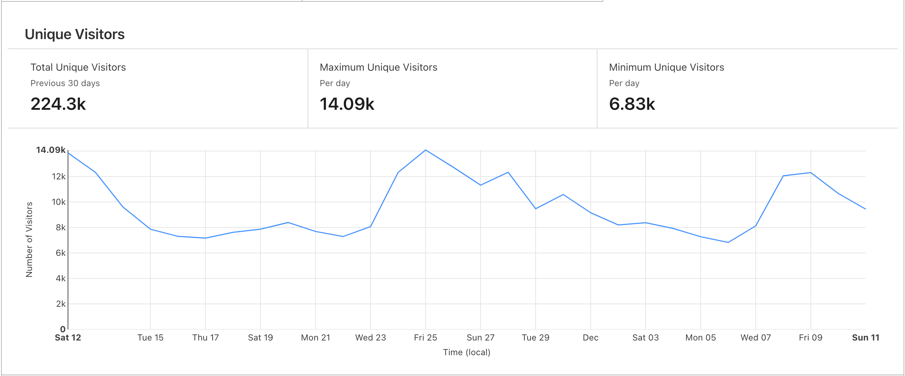

According to my message history, it all started around February 2020 when I found out about Spicetify through some random Reddit post in the illustrious [r/unixporn](https://www.reddit.com/r/unixporn/) - a subreddit where the highest tier of nerds share their Unix setups and configs - and I was immediately intrigued.

I had been using Spotify for a while, but even though the UI is not **awful**, they do have some very anti-user behaviours. Initially, I was simply a user, but then ideas to improve it started coming up, and I started to develop a more active role in the development. One of my first contributions was to the [New Releases Custom App](https://spicetify.app/docs/advanced-usage/custom-apps#new-releases). This extension creates a page where we can see all the new releases for the artists we follow. Conceptually, it is a simple feature, however, Spotify's "notifications" were practically useless, even to this day **[1]**, which made it quickly become one of my favourite Spicetify features, which also led to my first contribution ([spicetify-cli#247](https://github.com/spicetify/spicetify-cli/issues/247)).

> **[1]** They did do **something** on mobile, but if you follow more than 30 artists the list gets pretty polluted with singles. The only filter available is either Music or Podcasts, which is not very useful. And I mostly listen to Spotify on my PC anyway, so it doesn't really matter.

Spicetify's core, what we call [spicetify-cli](https://github.com/spicetify/spicetify-cli), is a Command-line Interface (CLI) tool that goes through Spotify's binaries mutating them through regex matching to allow for the promised customisation. It is written in Go, which is a highly performant language that I learnt a couple of years prior to give a [workshop](https://github.com/afonsojramos/competitive-programming/blob/master/advent-of-code/2018/go-guide.md) on it at [IEEE University of Porto Student Branch](https://ieee.fe.up.pt/), a student branch of the IEEE that I was a member of at the time - and later was elected Vice-President for a year.

With time, I started helping out more and more in handling issues, developing small features, and keeping the latest Spotify version supported **[2]**. Eventually, [khanhas](https://github.com/khanhas) made me a maintainer on GitHub to help with everything. In late 2021, Spicetify's popularity truly blew up and we had to start handling a lot more issues and pull requests, which was a very exciting time for me. However, it was also the last time we saw khanhas, as he decided to leave the project and focus on other things. Thankfully, he left the project in a very good state, and I was able to take over as the new maintainer. Additionally, there were a small group of people that were already helping out with the project, which helped immensely.

> **[2]** Spotify releases most of the times do not break the CLI itself, but when they do it is because we need to apply updates to the regexes that match the Spotify binaries. This is a very tedious process, but it is crucial to keep the CLI working.

It was September 2020 when I started working full-time, but it was in 2022 that my workload, other side-projects and overall life started pilling up a bit more, and, eventually, I noticed myself not being able to dedicate as much time to Spicetify as I would have liked. This is when I shifted to a more managerial role, where I would help out with the more complex issues, but also help out with the more mundane tasks, such as reviewing pull requests and merging them. I also created the [Spicetify Documentation](https://spicetify.app) website, which is a very important part of the project, as it is the first place people look at when they want to customise their Spotify, unlike previously when people could only look at GitHub's wiki, which was not very user-friendly for newcomers. And also created the [Spicetify GitHub organisation](https://github.com/spicetify), which is where all our repositories are hosted since previously they were hosted across several different contributors' accounts.

Overall, it has been quite a ride, but seeing hundreds of thousands of downloads per GitHub release and over 200K unique visitors per month to our documentation is a very rewarding feeling. I am very grateful to all the contributors, users and maintainers that have helped out in this journey, and I hope that we can continue to make Spicetify better and better.
