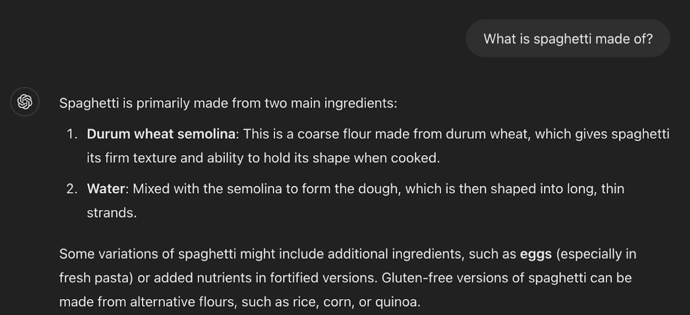

> This article was also published on the **CNCF blog** [here](https://www.cncf.io/blog/2025/01/03/optimising-prompt-engineering-for-better-ai-outputs/) and on the **YLD blog** [here](https://www.yld.io/blog/the-key-to-building-smarter-scalable-ai-powered-applications).

Remember when searching for information online involved typing in a few keywords and sifting through pages of results? Thankfully, those days are long gone. 

Today's search engines have transformed the way we find information online. From simple keyword matching to advanced technologies like semantic search and natural language processing, search engines have come a long way. But, have you ever stopped to consider the UX design choices that make these search experiences possible?

An effective UX/ search experience design involves a deep understanding of how humans interact with machines and the ability to adapt to that relationship. It's not an innate skill, but rather something that can be developed over time, much like the act of googling is a skill that many of us have honed through years of practice. Similarly, interacting with Generative AI models requires a certain level of skill and knowledge which involves Prompt Engineering. 

This article aims to provide a comprehensive guide to Prompt Engineering, helping you understand its importance, techniques, and best practices. You'll be equipped to create effective prompts that maximise the potential of AI models and enhance user experiences.

## Why is Prompt Engineering important?
Well-crafted prompts are essential for maximising the potential of AI models, particularly LLMs. They enhance AI performance by providing clear instructions and context, leading to more accurate and relevant responses. 

Prompt Engineering improves user experience by making interactions more intuitive and reducing ambiguity, minimising the risk of misinterpretation. It enables AI models to handle complex tasks, adapt to different use cases, and ensure consistency in outputs, which is vital for integrated systems. 

## Precision in Prompt Engineering
Prompt Engineering is a discipline that involves developing and optimising prompts to efficiently use language models for a wide variety of applications and research topics. This discipline is particularly useful for developers, researchers, and anyone looking to leverage AI models for various applications and research topics. It encompasses various skills and techniques essential for interacting with and developing LLMs. Mastering this discipline enables you to optimise these interactions, achieving more accurate and relevant outcomes.

A prompt refers to a statement or question that is employed to trigger a response from a language model or other AI system. Prompts are generally crafted to offer context or instructions to the AI model, directing it to produce a specific type of output or carry out a particular task. A prompt can be provided to the language model by the user or by the system itself, serving as a means to define its default behaviour.

Creating effective prompts requires a deep understanding of both the AI model (various models respond uniquely to different types of prompts) and the user's intent. Just as search engines use algorithms to understand the user's query and return relevant results, Prompt Engineering involves designing prompts to communicate the user's intent to the AI model. 

Experimenting with different formats, testing various instructions and contexts, and refining the prompt based on the AI model's responses are key to creating prompts that produce the desired response from the AI model while minimising the risk of misinterpretation or ambiguity.

The images below demonstrate how slight prompt variations can lead to very different results. However, consistency is crucial in integrated systems. A good prompt aims to produce repeatable outputs with minimal variation, ensuring reliable and predictable AI performance.

  Screenshot of the first prompt: “What is spaghetti made of?”

  Screenshot of the second prompt with a slight variation: ”What is spaghetti?”

When it comes to the daily interaction with an LLM, a varied yet similar result would be acceptable. But, when it comes to using an LLM as part of an integrated system, consistency is an important factor. What makes a prompt “good” is about producing a somewhat repeatable output with minimal variation.

## Are all prompts equal?
No. Not all prompts are created equally because different types of prompts serve different purposes and can significantly impact the quality and relevance of the AI model's responses. Understanding the various types of prompts and their applications is key to effective Prompt Engineering.

As a way to scientifically define methods of communication with LLMs, many have tried to create both techniques and frameworks that systematically define how to write these prompts. 

Here are some common types of AI prompts that serve unique purposes:

**One-Shot and Few-Shot prompts**: If you want to follow a structure for a JIRA ticket, providing a well-structured template will help the AI generate similar ones. Few-shot or One-Shot prompts both help the AI adapt quickly to new tasks by providing a small set of examples, enhancing its ability to generate relevant and accurate responses. These prompting techniques involve providing the AI with examples of the desired task or output before asking it to complete a similar task. By showing the model what is expected through one or a few examples, the AI learns the context and format needed and applies it to new inputs. 

**Zero-Shot prompts**: A practical use case is asking the AI to translate a sentence from English to French without providing any examples; the AI must rely on its pre-training to understand and perform the task. This approach is particularly useful for assessing how well the AI can handle novel or unexpected queries, demonstrating its ability to apply learned patterns to new contexts. Unlike few-shot prompts, zero-shot prompts require the AI to perform tasks without prior examples, relying solely on its pre-training. This approach is valuable for evaluating the AI’s adaptability and versatility.

**Chain-of-Thought prompts**: These prompts guide the AI to follow a logical progression or reasoning pathway to reach a conclusion or solve a problem. The prompt encourages the AI to detail its
Each of these Prompt Engineering techniques can be adapted and combined depending on the specific requirements of the task at hand and the capabilities of the AI model being used. 

**Hybrid prompts**: Combining multiple techniques, hybrid prompts might integrate direct instructions with creative challenges or conditional elements with exploratory questions to guide the AI more effectively according to complex needs. For example, you might provide the AI with a Few-Shot prompt to understand the structure of a report, then add a Chain-of-Thought prompt to ensure it details its reasoning, and finally include a Meta-prompt to ask the AI to reflect on its approach. Hybrid prompts are versatile and can be tailored to meet the specific requirements of various tasks, making them particularly useful for complex and multi-faceted projects.

Effective Prompt Engineering involves a deep understanding of these techniques and the ability to apply them creatively. By leveraging the right prompt type, you can significantly enhance the AI model's performance and the overall user experience. If you want to read more about the several types of prompts, check out [Prompting Guide's techniques page](https://www.promptingguide.ai/techniques).

## Writing your best prompt
Crafting the perfect prompt is like giving directions to a slightly distracted, incredibly smart friend - you need to be clear, concise, and maybe even a little clever. 

Start with a basic prompt and refine it iteratively based on the responses you receive, fine-tuning the AI's outputs to your specific requirements. Incorporate relevant keywords and specific details to guide the AI more effectively towards the desired output. 

Moreover, don’t use jargon or assume knowledge. Be aware of the model's limitations to craft prompts within its capabilities, avoiding overly complex requests that lead to poor responses. Utilise feedback to continuously improve your prompts, as insights from users or the outputs themselves can guide adjustments for better results. 

Mind the length of your prompts to prevent confusion and higher token consumption, which can increase costs. 

Although the model may be equipped to handle specific challenges like trick questions about prime numbers, this doesn’t guarantee it can manage every query type. Even after conjuring the best prompt, the model can still confidently reply with false information. In some cases, it might only succeed because similar examples were included in its training data, as shown in the examples in the screenshot below:

  Screenshot showing an interaction with Gemini, where the prompt contains trick questions, making it unlikely to provide a factual answer.

  Screenshot of prompting ChatGPT to provide unbiased, factual mathematical answers about the possibility of prime numbers ending in 42.

## Closing thoughts
If you find yourself facing a complex problem and need assistance in crafting effective prompts, don't hesitate to ask AI for help. Leveraging the AI's capabilities can provide valuable insights and suggestions to refine your prompts, ensuring you get the best possible outcomes. If you feel confident in your prompting capabilities, put yourself to the test against [Gandalf](https://gandalf.lakera.ai/).

Finally, different types of prompts complement each other, and combining them can lead to more effective and nuanced interactions with AI models. Whether you're using One-Shot prompts for quick adaptation, Zero-Shot prompts for versatility, or hybrid prompts for complex tasks, understanding how to leverage these techniques together can significantly enhance the AI's performance and the overall user experience.

