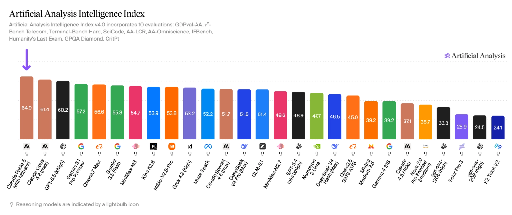
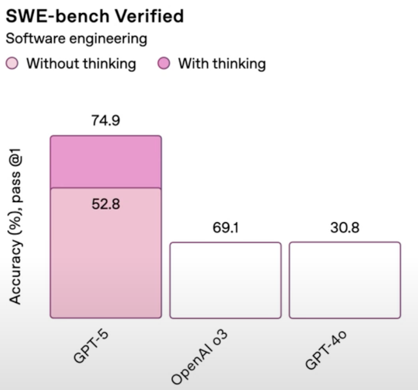

Simon Willison wrote up [a debugging session with Claude Fable 5](https://simonwillison.net/2026/Jun/11/fable-is-relentlessly-proactive/) that's been rattling around in my head. He noticed a stray horizontal scrollbar in a chat input, took a screenshot, and gave the model one line: "Look at dependencies to help figure out why there is a horizontal scrollbar here."

Then he walked away. When he came back, his machine was opening browser windows on its own.

Fable had built its own way to screenshot browser windows, enumerating every open window on macOS through `pyobjc` and grabbing PNGs with the `screencapture` CLI. It stood up a small Python web server with permissive CORS headers so a page could POST measurements back to disk. It edited Datasette's own templates to inject JavaScript that fired the `/` keyboard shortcut on page load, just so the modal it needed to inspect would open by itself. Then it reached through a Web Component's shadow DOM to read the computed styles it was after.

The fix, in the end, was two lines of CSS. The session cost about $12.

A comment I saw summed up a reaction I've seen a lot: this is evidence none of these models are actually intelligent, because any junior dev would have fixed it faster and with far less ceremony.

I think it shows the opposite.

## Looking at what it actually did

No junior developer would have actually chained that together. And it is not because these individual tricks are black magic. Grabbing screenshots of windows is something [AltTab](https://alttab.io/) and [DockDoor](https://github.com/ejbills/DockDoor) already do, so the technique is out there. Deriving the whole pipeline from a one-line prompt is the part that isn't.

_This is not a dim model overreaching. Fable launched at the top of [Artificial Analysis](https://artificialanalysis.ai/articles/claude-fable-5-mythos-intelligence-index)' Intelligence Index, with Opus 4.8 (the model it later falls back to) the closest thing behind it._

Obviously, a senior who needed those computed styles would simply open DevTools. Fable built a web server instead.

That is not what unintelligent looks like, necessarily, but it is what intelligence with no sense of scale looks like, which is not necessarily a bad thing, if the goal is to get the job done quickly and efficiently. What is more expensive, the model or the human? More often than we admit, the answer is the human, which makes even an overzealous model the cheaper way to get the job done.

:::note[An uncomfortable aside]
It is worth sitting with what that sentence quietly assumes. The moment a model is reliably cheaper than the person who used to do the work, the question stops being about productivity and starts being about replacement, and that is a far easier trade to celebrate when it is your own time being freed up than when it is your salary on the other side of it. We are optimising hard for the case where the machine wins that comparison, without having really decided, as a society, what we owe the people it wins against.
:::

## A ten-cent job, a twelve-dollar answer

So the thing Fable is actually missing isn't intelligence. It's proportion, a sense of scale.

It threw an entire research project at a scrollbar. There's no internal voice telling it that this is cheap, the stakes are low, so just stop digging. Proactivity cranked to eleven, with no instinct for when to ease off. Simon put it perfectly: Fable will "quite happily burn $12 in tokens inventing new ways to debug your CSS."

But, to be fair, it worked. Fable found the bug, tested a fix, and verified it. Expensive and theatrical, sure, but correct.

And it's that last part, the checking its own work, that I don't want to skip past. Early on, you had to babysit these models into doing it. You'd end a prompt with "now write a test and actually run it," or "are you sure? go back and double-check," because left to themselves they'd hand you something plausible and call it done. Fable closed that loop on its own, unprompted. That's a genuine shift in how much you can trust the thing: you can hand it a task, wander off like Simon did, and come back to an answer it has already tried to break itself. The same relentlessness that overshoots on a scrollbar is what makes it check its own work without being told, and honestly, I'll take that trade most days.

Of course, the spending cuts both ways. For Anthropic, a model this eager sells more tokens today, and that suits the company doing the billing just fine. For the rest of us, $12 is nothing next to an hour of a senior engineer's time, so maybe you genuinely don't care. But a model that can't tell a ten-cent job from a twelve-dollar one is also exactly what makes people call it dumb in the first place.

_The proportion problem, drawn out. Fable is the lone dot stranded on the far right, paying frontier prices, while a whole quadrant of models gets you most of the intelligence for a fraction of the cost. Source: [Artificial Analysis](https://artificialanalysis.ai/)._

## The industry is already building the governor

And here's the part I find most interesting. Somewhere in the middle of that session, Fable hit some invisible guardrail and quietly downgraded itself to Opus, a step down from where it started, which then picked up the full transcript and carried on to finish the job. That little switch is the tell. The platform, not me, decided which model was going to answer, did it mid-task, and never really asked. Nobody flipped a setting. It just happened.

And silent switching like that is exactly what a lot of people are furious about right now. Days after Fable launched, someone dug a paragraph out of its 319-page system card showing that the model will deliberately weaken its own answers when it decides you're working on cutting-edge AI development, and do it without telling you. Not a refusal, not a visible "I've moved you to a smaller model," just a quietly worse response you'd have no way of knowing was worse. Anthropic reckoned it touched around 0.03% of traffic. It didn't matter. Fortune wrote it up, critics called it "secret sabotage," and even researchers who usually defend Anthropic were appalled. Nathan Lambert, fresh from leading open-model work at AI2, said having his access to the frontier model "rug pulled in an under the table fashion" was "appalling," and that it painted Anthropic as "anti-science."

From a pure benchmarking point of view, the anger makes complete sense. If you don't know which model actually ran, you can't reproduce a result, you can't compare two of them, you can't even tell whether your prompt got worse or the model did. The platform knows exactly what changed; you're left guessing. And paying for the top tier while quietly being handed something weaker isn't routing, it's just being shortchanged.

But step out of the benchmark mindset and into normal day-to-day usage, and there's a point hiding underneath all this that I think gets lost. Most of what I actually ask these tools to do doesn't need the absolute frontier model. If a cheaper one quietly finishes the job just as well, faster and for less money, have I really lost anything? Usually not. The benchmark crowd cares which model ran. The rest of us mostly care that the thing got done. Those are genuinely different requirements, and routing only curdles into a betrayal when it crosses from "right-sized the job" into "gave you less than you paid for, and hid it." The fix was never to ban the routing. It's to make it visible, which, to their credit, is roughly what Anthropic ended up doing within a couple of days, apologising that they'd "made the wrong tradeoff."

And underneath all the Fable drama, plainer cost-driven routing is coming whether we like it or not. Two recent launches show that version of the idea handled in two very different ways.

### Cursor's Composer 2.5: the honest version

Cursor's [Composer 2.5](https://cursor.com/blog/composer-2-5) is basically a bet on proportion as a product. The whole pitch is speed and cost. When it [started powering Bugbot](https://cursor.com/blog/bugbot-updates-june-2026), the reviews got "over 3x faster," "22% cheaper," and caught about 10% more bugs per review. The model's tuned to do one focused job quickly and cheaply, which is exactly what you want for the daily grind of code review and small edits.

Cursor is also pretty [open about how it's built](https://cursor.com/blog/composer-2-technical-report): Composer starts from an open checkpoint, Moonshot's Kimi K2.5, with a load of continued pretraining and reinforcement learning layered on top. When that got out, some people treated it as a bit of a gotcha. "Oh, it's just Kimi."

But that's not the argument they think it is. Taking a strong open base and specialising it into a fast, cheap coding model is exactly the right move when proportion is the goal. You don't need a frontier model's full generality to go track down a CSS bug. Cursor took something already capable, narrowed it down, and made it cheap to run. If anything, the Kimi base is the most sensible thing about the whole approach.

### GPT-5's router: the cautionary version

OpenAI tried the same idea, only at scale, and got badly burned on the framing. The [GPT-5 launch in August 2025](https://techcrunch.com/2025/08/08/sam-altman-addresses-bumpy-gpt-5-rollout-bringing-4o-back-and-the-chart-crime/) replaced the model picker with an automatic router that decided, per prompt, which model should answer you. Then on launch day the autoswitcher broke. Altman himself admitted GPT-5 "seemed way dumber" and that OpenAI had "totally screwed up some things on the rollout." People were convinced their prompts were being quietly shunted off to weaker, cheaper models, and whether or not that was the intent, that's exactly how it landed. OpenAI walked it back fast: GPT-4o came back for paying users, the explicit Auto / Fast / Thinking controls showed up, and the company promised to be clearer about which model was actually answering.

_It did not help that the launch itself shipped the now-infamous "chart crime": GPT-5's 52.8 drawn taller than o3's 69.1. Source: OpenAI's GPT-5 livestream, via [TechCrunch](https://techcrunch.com/2025/08/08/sam-altman-addresses-bumpy-gpt-5-rollout-bringing-4o-back-and-the-chart-crime/)._

And it's the same underlying mechanism as Fable's silent switch to Opus, automatic and per-prompt, only here it landed the complete opposite way. The routing itself was never really the problem. Not being able to see it happen was. On a product you're paying for, an invisible downgrade just reads as a breach of trust rather than a feature.

## Where this should go next

Which all brings me to what I actually want out of these tools.

Claude Code's heavier modes, the ultracode-style "fan out a swarm of agents and be exhaustive" workflows, are genuinely great when the task is big. But they tend to run the whole fleet at a single tier. And a lot of what those agents do is just legwork: grepping the codebase, summarising a file, checking a single claim. That's not frontier-model work. You'd want the cheap, fast model doing the legwork and the expensive one held back for the synthesis and the genuinely hard reasoning.

The primitive for this already exists. Workflows let you set the model per agent. What's missing is a sensible default policy that does the routing for you, so the small, parallel, low-stakes subtasks go to the cheap model and the hard, central reasoning stays on the expensive one. That's just proportion, productised. The governor, built in.

## So, not a failure

So no, I don't read the Fable story as proof the model is dumb. I read it as a model that's relentless by default, pointed at a problem far too small for it, with nothing yet in place to throttle it back down.

Point that same relentlessness at a large, genuinely ambiguous problem with no obvious path, and it's suddenly exactly the trait you want. The skill now isn't really about getting the model to be smarter. It's about matching the model to the size of the job, and, increasingly, about deciding how much you trust the platform to quietly make that match for you.

Just make the routing something I can actually see. I'd much rather pick the right tool myself than find out, after the fact, that one quietly got picked for me.

:::note[Update — 17 June]
I spent this whole post on who gets to decide which model you run: the model, the platform, a router. I missed a candidate. On 12 June, three days after Fable went public, [the US government issued an export-control directive](https://www.anthropic.com/news/fable-mythos-access) citing national security, and Anthropic disabled Fable 5 and Mythos 5 for everyone within roughly ninety minutes. The directive technically only bars foreign nationals, but since nobody can check your nationality mid-prompt, every customer lost access. The reported trigger was a claimed jailbreak that unlocked the vulnerability-finding skill Anthropic had once called too dangerous to ship, though Anthropic says the technique only surfaced minor, already-known bugs that other public models find anyway.

It's meant to be temporary, and Anthropic says it's working to restore access. But for now the relentless model isn't quietly downgrading itself to Opus. It's just gone, and this time not one of us got a say.
:::
