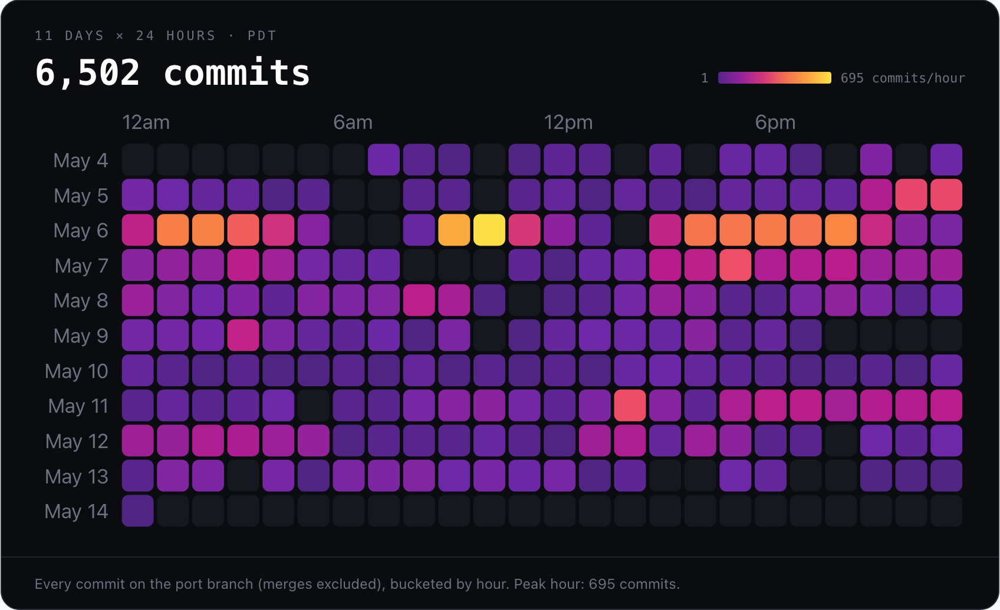
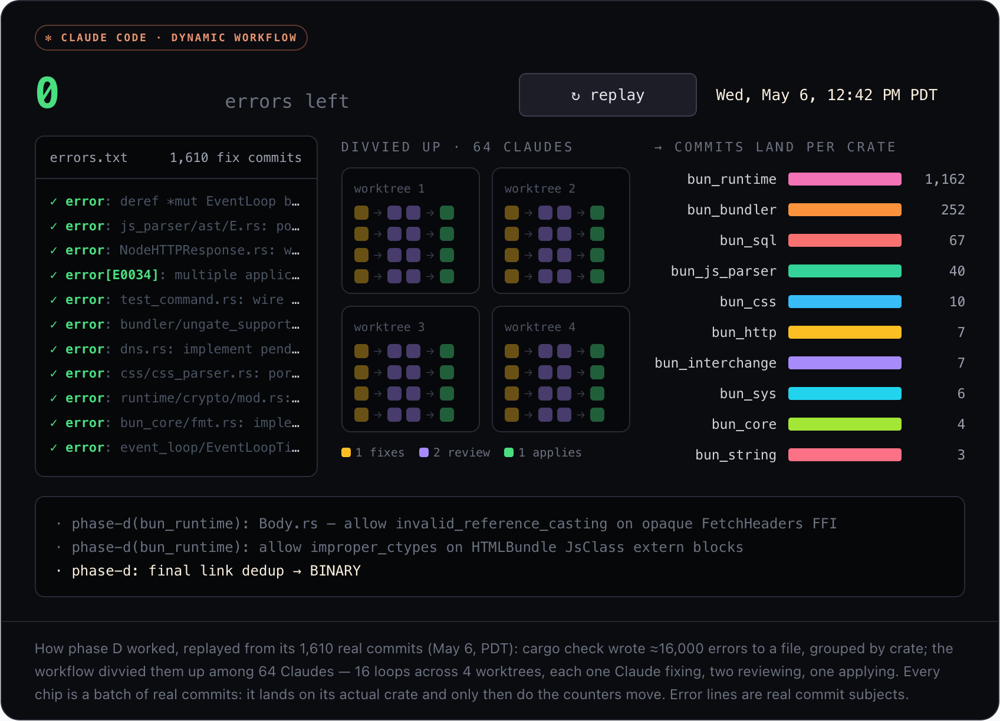
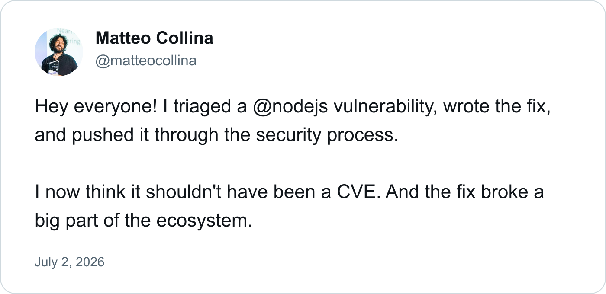
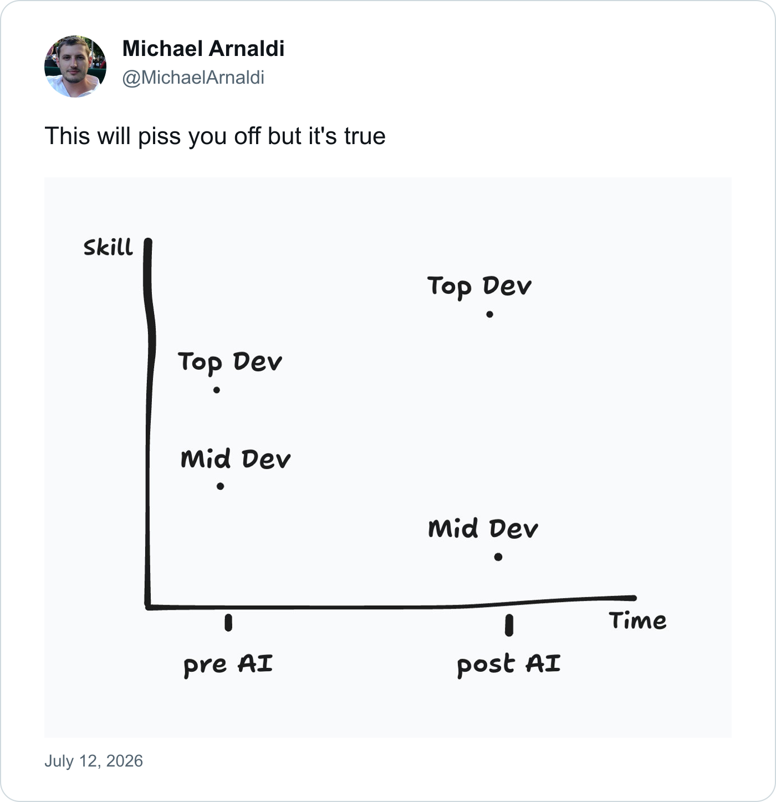
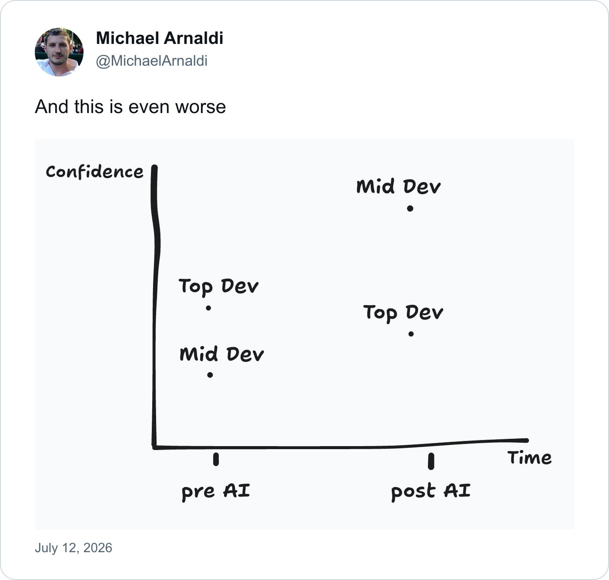

The recent dispute between Bun creator Jarred Sumner and Zig creator Andrew Kelley made me uncomfortable enough that I went back and [updated an old post](/blog/elysia-vs-hono-astro-cloudflare).

I had ended that post by saying I was "extremely bullish" on Bun. I wrote that its built-in server might eventually make us reach for frameworks like Hono and Elysia less often. I still use Bun in production, and much of what impressed me then still impresses me now. But I have also dealt with memory leaks in long-running Bun processes, along with surprise Railway bills, and the public discussion around its rewrite from Zig to Rust made those incidents harder to dismiss as isolated rough edges.

Bun's [account of the rewrite](https://bun.com/blog/bun-in-rust) is unusually candid about the memory leaks, use-after-free bugs, crashes, and other stability problems that motivated it. Kelley responded with [a much harsher explanation](https://andrewkelley.me/post/my-thoughts-bun-rust-rewrite.html): the problem was not Zig, he argued, but a culture that accumulated technical debt while racing from feature to feature. The exchange became personal, and I have no interest in refereeing the history between them. Both are far better systems programmers than I am.

What unsettled me was the engineering philosophy underneath the argument.

## AI made an old trade-off cheaper

The software industry's fixation on speed did not arrive with LLMs. "Move fast and break things" predates ChatGPT by more than a decade. Startups have always raced to launch, disrupt a market, copy a competitor, or reach feature parity before the runway runs out.

LLMs did not create that instinct. They removed a great deal of the friction that used to constrain it.

If code is cheap to generate, why spend time making it maintainable? If an agent can rewrite the implementation tomorrow, why understand the one it produced today? If the test suite passes, why read a million-line diff?

Those questions sound new because the scale is new, but the values behind them are not. We have always had teams that treated code as disposable output and teams that treated it as a system somebody would have to understand later. Coding agents simply let both groups move faster in the direction they were already heading.

That is why the Bun rewrite is such a useful case study. Sumner describes using around 50 Claude workflows over 11 days to translate more than half a million lines of Zig into Rust.

This was not a one-line "rewrite Bun" prompt: before the translation, Sumner worked with Claude to produce a detailed [Zig-to-Rust porting guide](https://github.com/oven-sh/bun/blob/3157cb14b5970b69532a47800504a28ef5963e22/docs/PORTING.md) that mapped types, lifetimes, naming conventions, and common idioms for the agents to follow. It is an extraordinary demonstration of what coding agents can do. It is also a million-line change that no human could review in the conventional sense. Bun instead relied on its test suite and adversarial review agents to establish confidence in the result.

Maybe that works. I genuinely hope it does. But passing tests and maintainable software are not the same property. Tests can show that the behaviours somebody anticipated still work. They cannot prove that the new implementation is understandable, that its abstractions will survive the next five years, or that the test suite covers the assumptions carried silently from the old code.

The rewrite changes the language. It does not automatically change the incentives that produced the original codebase. That does not mean Bun's Rust codebase is necessarily bad. The porting guide, test suite, and adversarial reviews may have produced something excellent. It does mean that the primary goal of its creation was a fast, faithful translation, not the slow cultivation of an idiomatic Rust codebase that humans had reviewed line by line. That trade-off is acceptable for plenty of software. I am less certain about it in a runtime that may become the foundation underneath everything else an application does.

Bun is not alone in testing that boundary. Node.js core maintainer Matteo Collina opened a [large, AI-assisted virtual file system pull request](https://github.com/nodejs/node/pull/61478), disclosing that he had used a significant amount of Claude Code and personally reviewed every change. The implementation grew to around 9,200 lines, alongside more than 11,000 lines of tests, and the resulting debate caught even one of Node's most experienced maintainers in a much larger argument about authorship, reviewability, and responsibility. Former Node core contributor Fedor Indutny responded with [a petition to reject LLM-generated pull requests from Node core](https://github.com/indutny/no-ai-in-nodejs-core). The comparison makes the question harder, not easier: Node has mature governance and an experienced maintainer explicitly accepting responsibility for the code, yet the scale of AI-assisted work still strained the community's idea of what meaningful review looks like.

And AI is not required for review and process to fail. Collina recently described triaging a Node.js vulnerability, writing the fix, and pushing it through the security process, only to conclude later that it should not have been a CVE at all—and that the fix had broken a large part of the ecosystem.

Michael Arnaldi highlighted two uncomfortable details from the aftermath:

The point is not that Collina is careless. It is almost the opposite: experience, tests, and an established security process still did not make the consequences obvious before the change shipped. AI increases the volume of decisions we can make, but it does not proportionally increase our ability to understand their consequences. A green test suite cannot be the whole definition of quality, because both humans and agents can optimize the evidence while missing what the software will do in the wider ecosystem.

## Quality is not the opposite of speed

We often talk about quality and speed as opposite ends of a slider. Move one up and the other must come down. That framing is convenient because it makes every shortcut sound like an explicit business decision: yes, we know this is messy, but right now we need velocity.

In my experience, the trade-off only works that cleanly over very short periods.

You can move quickly through an empty codebase. You can also move quickly through a codebase whose boundaries are clear, whose behaviour is tested, and whose previous authors left enough context for the next person. What slows a team down is the middle state: software that ships rapidly but makes every subsequent change more uncertain.

The pull request that skips an edge case saves an hour today. The missing test costs a day when somebody changes the same path six months later. The abstraction nobody understood was faster to generate than to design, until five features depend on it and every modification requires another workaround.

This is why the engineers who appear most preoccupied with quality are often the ones moving fastest over a meaningful span of time. They review the pull request. They ask what happens on the strange input. They remove ambiguity before it spreads. None of that looks fast while it is happening, because the time saved belongs to the future and is difficult to put in a sprint report.

Today, that scrutiny does not have to begin when a pull request reaches somebody else. It can happen while you build: iterating with an LLM, asking it to challenge the approach, inspecting its diff, and testing the assumptions together before the change leaves your machine. A later review still matters because a fresh context can see what the author and agent normalized along the way, but quality is stronger when it is part of the implementation loop rather than a gate at the end of it.

Quality, in this context, does not mean clever architecture or adherence to every fashionable best practice. It means maintainability: correct software that can continue changing without requiring its authors to rediscover the entire system each time.

## The smallest useful habit

I am not writing this from a position of purity. I have shipped plenty of software I would not want used as evidence of my engineering philosophy. I use coding agents every day, often aggressively. I like that they let me build more than I could before, and I am not interested in returning to an era where typing speed or tolerance for repetitive work determined what got made.

The lesson I take from all of this is not that generated code is bad, that Rust is better than Zig, or that moving quickly is irresponsible. It is that abundant implementation makes judgment more important, not less.

When producing another version is nearly free, the scarce work is deciding whether the version is good. Someone still has to understand the trade-offs, inspect the boundaries, question the happy path, and decide what the software should be able to survive. An agent can participate in all of that, but asking it to review its own output twice does not make those decisions disappear.

The smallest useful response is still code review. Read what your agents produce. Read what your colleagues produce. Ask the annoying question about the edge case. And follow the small code smells instead of automatically working around them. If a function name does not quite describe what the function does, find out why. Read the surrounding code, understand the current state of the system, and decide whether the mismatch is local or evidence of an abstraction that has drifted over time.

Leave things better than you found them. That advice used to come with a real risk: a thirty-minute change could trigger several days of refactoring before you were confident enough to ship it. Coding agents have made that investigative work much cheaper. You can trace callers, rename an unclear concept, update the tests, and verify the surrounding behaviour without immediately disappearing into the kind of refactoring loop that once made this instinct difficult to defend. That does not mean expanding every task into a rewrite. It means we have fewer excuses for preserving confusion when understanding and improving it is now so much faster.

Software has always rewarded speed, and that pressure has produced plenty of remarkable things. But once you have worked in the same system long enough, the relationship starts to look reversed: quality is not what you sacrifice to move fast. Quality is how you keep moving fast after the first release.
