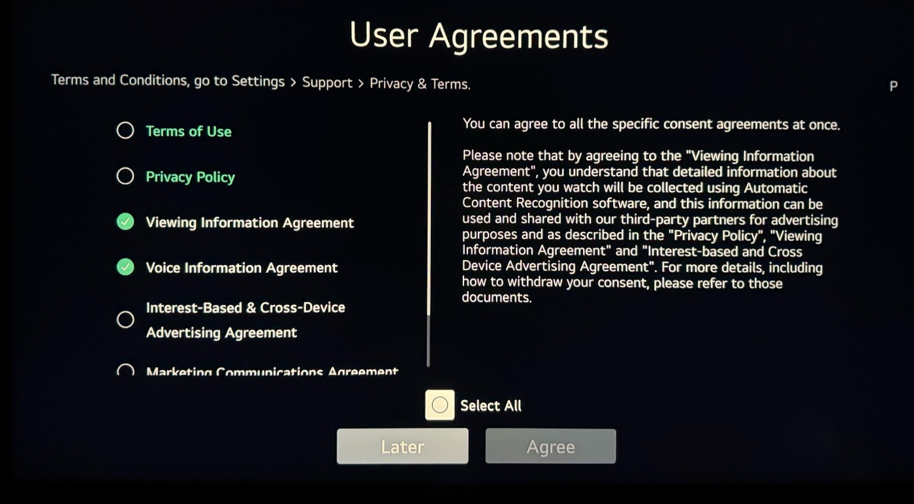
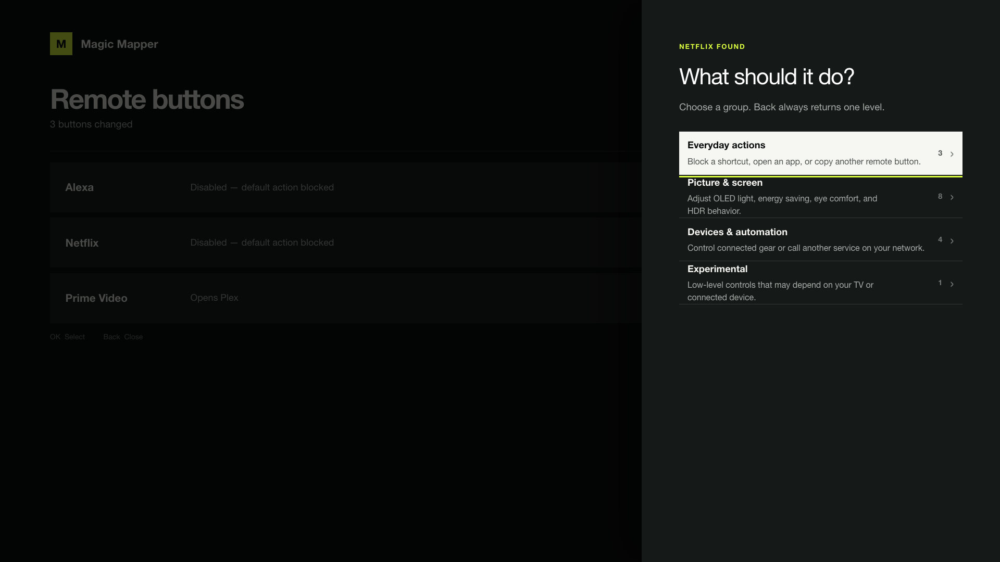

You could always just do things. What AI changed is the time an attempt costs, and time was most of the decision of whether to do something. If you only want that argument, it is [at the end](#the-route-i-would-have-taken); everything between here and there is the evidence.

This started with one of those things that bugs you every day until you break.


Plex would play for a while on my Xiaomi TV Box S 3rd Gen, stop to buffer, recover, and eventually become annoying enough that I restarted the box. The restart usually helped and mostly avoided the problem, which made the diagnosis feel obvious: the hardware was underpowered, Xiaomi had filled Android with too much garbage, or the firmware had reached the point where replacing it would be easier than understanding it.

I started looking for custom ROMs. I wondered whether rooting the box would make it faster. I was already thinking about replacing it with a more easily rootable Android TV device and rooting that instead.

None of those things would have fixed the problem.

But, by the time I finished this journey, the Xiaomi was still running its stock firmware and Plex no longer buffered. The more interesting work eventually moved to my LG C3, which was now rooted, stripped of several layers of optional data collection, and running a small webOS application I had not intended to build.

As with [my homelab](/blog/accidental-homelab), there was no plan connecting those outcomes. I was purely exploring how much better I could make the hardware I already owned, and each irritation led me to the next one.

## I nearly rooted the wrong device

My initial goal was to root the Android box. Plex was reporting Direct Play, and I had been treating that as evidence that the path between the server and the box was healthy, which left the box looking like the problem. I did suspect the router, since I am _temporarily_ on a cheap ISP-provided one, but I never thought it was _just_ because I was on 2.4 GHz instead of 5 GHz.

But as soon as I started going deep into this, I noticed that the measurement that mattered was below Plex entirely. The Xiaomi had associated with the 2.4 GHz band of my combined network, and its average latency to the router, not to Plex, not to the Internet, but to the first hop across the room, was roughly **1,323 ms**, with **5% packet loss**. I added a 5 GHz-only SSID and moved the box onto it. Latency fell to **4.65 ms** and packet loss to **0%**. The same Plex file stopped buffering.

Rooting the box would have been an impressively complicated way not to fix a bad wireless connection. That is the failure mode of cheap experiments: they are just as cheap to point at the wrong thing.

## I just hate all tracking and advertising

The box still deserved a cleanup. Wireless debugging gave me ADB without opening anything or unlocking the bootloader, and I removed what I did not want: the Xiaomi telemetry packages (`com.xiaomi.statistic`, `com.miui.tv.analytics`), the preinstalled streaming apps, and the ad-filled Google TV launcher, which Projectivy replaced. Twenty packages uninstalled, twelve more disabled, nothing flashed.

Four of the removals were `com.android.adservices.api`, `com.android.sdksandbox`, `com.android.ondevicepersonalization.services`, and `com.android.federatedcompute.services`. On this Android 14 build, `system_server` crash-loops without them. The first time, the loop only surfaced at a cold boot after a power cut, and Android's Rescue Party escalated to a factory reset: every removal reverted, and my own apps went with them. When I re-removed the same four during the second pass, the box reset immediately.

They stay installed now. Of everything I deleted, from TalkBack to the calendar sync adapters, the packages this television box refused to live without were the advertising machinery. Anyways, blocking that traffic can live in the router firewall rules once I replace the ISP router with a UniFi Wi-Fi 7 one.

## The LG was a different kind of problem

Fixing the Xiaomi should have ended the project. I mean, I already had Button Mapper on it, so its buttons were already custom: the Netflix button led to Plex and YouTube to SmartTube. But instead, it made me look at the LG C3 it was connected to and ask a different question: if I could remove the things I did not want from Android, how much of the LG experience could I make mine?

The LG was not slow. I was bothered by the promotions, branded remote buttons, ACR ([automatic content recognition](https://en.wikipedia.org/wiki/Automatic_content_recognition)), opaque privacy controls, and the general feeling that buying the panel had not quite bought control over the computer attached to it. This is why I usually recommend that no one connects their TVs to the internet unless there is a specific firmware update to be made.


This time, root access was relevant.

The TV was running webOS 25 on firmware 33.31.68. I checked the exact model and firmware against the community compatibility data, read through [SlopBro](https://github.com/throwaway96/slopbro), and used a recorded source revision rather than an unknown binary. There is no useful percentage for the risk of bricking a television this way. The exploit itself normally either works or fails; the more durable risk begins after it succeeds, when a root shell makes bad ideas possible.

SlopBro installed and elevated Homebrew Channel 0.7.3. The icon appearing was encouraging, but it was not proof of root. A shell returning this was:

```text
uid=0(root) gid=0(root)
```

I then rebooted the TV and checked again. Root SSH returned automatically, the Homebrew startup hook ran, and the same shell still had UID 0. That distinguished persistent root from an application that happened to launch once.

The first job after gaining access was reducing how much access I had created. I installed a dedicated Ed25519 public key, required key-based SSH authentication, disabled the unauthenticated Telnet service, and confirmed port 23 stayed closed after reboot. I also enabled Homebrew's firmware-update block. Rooting a television and leaving a passwordless root service listening on the network would have been a strange definition of taking control.

## The privacy screen was only one layer

Several visible settings were already off: home promotions, content recommendations, screensaver advertising, personalised recommendations, and customised advertising.

The underlying consent state told a less reassuring story. The TV still recorded permission for marketing, data-partner processing, viewing-information collection, interest-based advertising, voice-information processing, shopping-related processing, and ACR/LivePlus-related processing. The mic button was the daily reminder: pressing it did not open a microphone, it opened a terms-and-conditions screen asking me to accept voice processing, a menu that does not have an option to refuse those terms :)



_LG's User Agreements screen, spelling out that viewing data collected through ACR "can be used and shared with our third-party partners for advertising purposes". Source: [Nielsen Norman Group](https://www.nngroup.com/articles/physical-discs-streaming-experience/)._

I saved the existing state under Homebrew's persistent data directory, then used webOS's own settings service to revoke the optional agreements. Network access and the essential service terms stayed enabled; the advertising, voice, shopping, partner-sharing, and additional-data flags did not. I read the values back through the same API and updated the user-facing agreement list so the interface and effective state agreed.

Homebrew also redirected LG's firmware-update hosts locally and mounted the standard telemetry upload queues read-only. Both mechanisms were verified again after reboot.

That still does not justify saying the TV makes no requests to LG. Its built-in tools were not enough to capture and attribute every DNS request and payload. I could see connections involving Google, GitHub, Cloudflare, AWS-hosted infrastructure, and local casting services, but an IP address is not proof of a hostname or purpose. A local resolver with per-device query logging would be the next honest step.

Root gave me enough leverage to disable known collection paths. It did not turn incomplete evidence into certainty.

## Root does not make old software compatible

The first Homebrew disappointment made the same point from another direction. I installed Custom Screensaver, and it did nothing.

The failure was not permissions, it was just that [webosbrew](https://repo.webosbrew.org/) does not have a way of detecting app compatibility with specific webOS versions. So, for example, Custom Screensaver 1.0.1 expected an old QML entry point at `com.webos.app.screensaver/qml/main.qml`. webOS 25 had replaced that implementation with a compiled Flutter application, so the path simply did not exist. Aerial and the other available replacements depended on the same older architecture.

But, having root meant I could inspect the failure clearly. In this case though, it did not mean forcing an old patch onto a new system was sensible, so I removed the inert application and left the stock screensaver alone. Next goal: disabling the branded remote buttons.

## The button that installed Rakuten

Now that I had restored internet access to my LG TV, the dedicated remote buttons went back to auto-installing services I do not use: Netflix, Prime Video, Disney+, Rakuten TV, and Alexa. LG Input Hook looked like the right tool for disabling them, so I configured the four streaming buttons through its web interface and was about to add Alexa.

Then I pressed Rakuten, and the TV started installing Rakuten.

The configuration was correct; the hook was not running. On webOS 25 its injector failed while resolving an internal glibc `dlopen` symbol, so none of its saved rules could intercept anything.

[Magic Mapper](https://github.com/andrewfraley/magic_mapper) took a different approach. It grabbed the Magic Remote input device, consumed configured buttons, and forwarded everything else to webOS. I pinned and reviewed its source, started it interactively with only the five branded buttons disabled, and pressed Rakuten again. This time the log said `Button rakuten is disabled`, and nothing opened.

I added a guarded startup script so the mapper returned after reboot. Functionally, the problem was solved.

Operationally, it was not.

Magic Mapper was a Python script, a JSON configuration file, and a startup hook. It had no launcher tile, no status screen, and no way to remove itself from the television's UI. Installing an invisible root service is easy. Leaving behind something another person can understand and safely undo is what makes it usable in a house where not everyone is technical (even if it is just a button mapper).

## So there was a missing UI

I initially imagined a small manager showing whether Magic Mapper was running, which buttons were blocked, and one large removal button. Once I looked further at the upstream feature set, that scope stopped making sense.

Magic Mapper could already adjust OLED brightness, change energy-saving and eye-comfort modes, turn off the panel, launch applications, simulate other remote buttons, send IR and HDMI-CEC commands, call webhooks, open TCP connections, toggle PicCap, and disable the Magic Remote pointer. So, huge props for that feature set! A UI exposing only the five actions I happened to need would make the underlying project look much smaller than it was.

The result became [Magic Mapper for webOS](https://github.com/afonsojramos/magic-mapper-webos): a standalone Homebrew application around a pinned, checksummed upstream runtime. It can discover a button while suppressing its normal action, present every upstream action through remote-friendly categories, validate the inputs, show authoritative runtime status, restore individual mappings, and remove its own state and startup hook cleanly.


The interface is deliberately television-shaped. There are no tiny form controls, browser-like sidebars, or seventeen equally weighted actions in one modal. Common actions come first; picture and screen controls, devices and automation, experimental commands, and global settings sit one level deeper. Back moves up one level (which turned into the hardest bug in the project).



## Back did not mean Back

With Magic Mapper holding the input device, pressing Back inside another application's nested menu exited the whole application instead of closing the menu. The UI was not mishandling navigation; every application on the television changed behaviour while the mapper was running.

Once again, the model went back to work, and together we reduced the problem to the two webOS output devices. Replaying the remote's raw Back sequence through the existing `[2]` passthrough caused an app exit. Sending a clean, complete Back keypress through `[1]` closed only the current menu, even while the physical input was exclusively grabbed.

The fix suppresses the original Back sequence on webOS 25 and replays one fresh keypress through the correct device. We tested it on the actual C3: Back closed only the nested menu, arrow and OK responded immediately afterward, and Netflix and Rakuten remained blocked.

That change belonged in the mapper rather than the new interface, so I separated it into a one-file [upstream pull request](https://github.com/andrewfraley/magic_mapper/pull/37). The standalone app keeps its UI, packaging, validation, and managed lifecycle separate from the clean upstream fork.

The frontend eventually moved to Vite, while giving SolidJS 2's release candidate a try. But the cool part is not the stack; it is how easy it became to bundle everything webOS needs and ship it to the TV.

## The volume bar that would not go away

Then came the final issue: pressing volume up left the bar on screen until I pressed something else. My first guess was the mic button, because I had disabled it and disabling buttons might well interfere with other buttons' behaviour. A quick test proved that assumption wrong. What settled it was capturing what webOS actually received:

```text
 95.617  EV_KEY  code=115  value=1   # volume up, pressed
104.557  EV_KEY  code=115  value=0   # released, nine seconds later
104.707  EV_KEY  code=103  value=1   # the D-pad press that flushed it
```

The key-up for volume arrived **nine seconds** after the key-down, at the exact moment I pressed the D-pad. The television was not failing to dismiss the bar. It believed the button was still being held.

The mapper opened the remote with a buffered reader and watched it with `select()`, which reports readability from the kernel queue. An evdev device writes a key and its `SYN_REPORT` together, so the buffered reader pulled both into user space in a single syscall, handed back one, and left `select()` looking at an empty kernel queue. Every event after that arrived one behind. The D-pad never dismissed anything; it was just flushing the release that had been sitting in the buffer.

The fix was simply setting `buffering=0`. The bug was in the first commit of the wrapper, so every release before 1.1.1 carried it, and it affected every button. Volume is just where a stuck key-up is visible.

Version 1.1.1 is [available on GitHub](https://github.com/afonsojramos/magic-mapper-webos/releases/latest) and installable through Homebrew Channel by adding `https://mm.afonsojramos.me` as a repository. I also submitted it to the [webOS Homebrew repository](https://github.com/webosbrew/apps-repo/pull/232).

## The route I would have taken

Would I have gone through this rabbit hole without AI? Maybe I would have dipped my toes, but time seems to run out more and more with age, the list of things I am involved in only grows, and the depth I reached here would have been _very_ different.

Without a model to argue with, I would 100% not have rooted the television. I would have done the cheap thing and never connected it. The Xiaomi box was already attached to the panel and already doing the work. A C3 that never sees a network shows no promotions, sends no telemetry, and has no button that installs Rakuten, because there is nothing for it to install from. That route costs one decision and no evenings.

What changed is not that I became more capable. It is just that the interesting route stopped costing weeks. Reading SlopBro's source, checking the recorded consent flags against webOS's own settings service, working out why an old QML screensaver cannot load against a Flutter implementation, building a webOS application in a stack I had not used: each of those was previously a whole evening, or several, and most of them would have lost to whatever else the week wanted. Compressed, they became things I could attempt on a Tuesday and abandon on Wednesday if the evidence said stop.

And it is not like the model made the decisions. What to try, what to measure, and when to stop stayed mine; what the model removed was the cost of acting on them. AI is great at enabling curiosity, the same way it is great at enabling a quick MVP.

None of this means I fully trust it to do everything. A model tends to run with whatever framing you hand it, and I handed it wrong framings the whole way through: the box is underpowered, the mic button broke the volume bar. What kept those errors cheap was insisting on measurements before conclusions: the latency test, the event capture. Agreement is a model's default state, not evidence.

There is a cost to this though, one that arrives later and that not everyone is willing to take. AI made the app cheap to build, not cheap to own. Magic Mapper for webOS can now run on other people's TVs, where I cannot watch it fail, and its first release shipped a bug I lived with for two weeks, the way I treat most small annoyances: ignored until it bugged me enough to dig in. No speed of building would have caught it. And if you check my other open-source projects, you will see that I tend to take care of things and make sure that issues are quickly resolved, but I'm not sure I can say the same about everyone's AI projects, and that can get annoying and pollute the open-source scene a bit. But when that is the case, a small fork will surely emerge from someone more willing to maintain something that helps others, because that is what keeps open source alive.

## Steering into the rabbit hole

I did not fall into this rabbit hole. I steered into it, one question at a time, and most of those turns were possible because root made the hard-to-read parts readable: consent flags, input events, failures. All I needed to do was ask.

The application that came out of this was not even a goal, it was just a conclusion from a series of questions that derived from the one the Xiaomi planted: if I could remove the things I did not want from Android, how much of the LG experience could I make mine? I was not looking for an open-source project to build. The exploration simply exposed gaps in what I wanted my experience to be, and given that similar projects existed for Android TV, they were not super hard to conceptualize. And if what I made makes other people's lives easier, all the better!

AI makes attempts like these cheap. The steering does stay expensive though, because you still need to know the right question to ask. But give in to the curiosity, read more about stuff, maybe even let AI help you through the journey, and at some point you will know what to ask. Because, at the end of the day, you can just do things!
