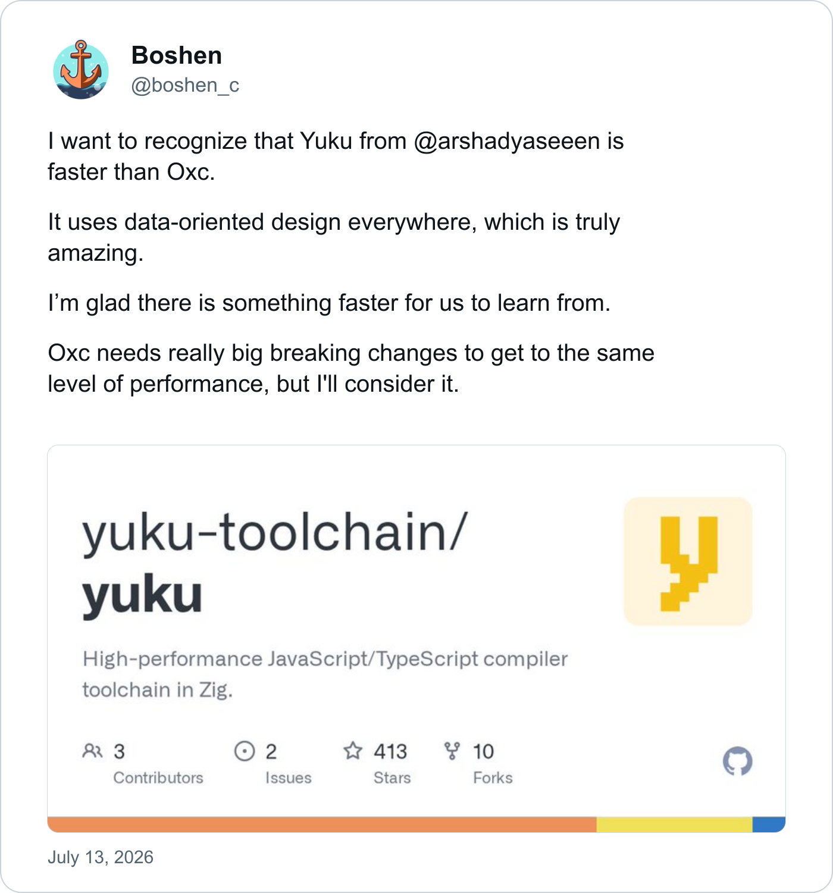

When [nub](https://nubjs.com) showed up on my radar, my first reaction was the [xkcd standards comic](https://xkcd.com/927/). I already had a working split: bun for the personal sites, pnpm for the serious apps, mise pinning versions across machines. The Node ecosystem does not have a package manager shortage. It has a package manager surplus with a discovery problem.

What got me to actually try it was the combination of an ambitious filesystem model and a migration story that barely qualified as a migration. nub is a single Rust binary with its own install engine, but it does not require a nub-specific lockfile. It [infers the incumbent package manager and mirrors it](https://nubjs.com/docs/install#compatibility): npm, pnpm, and Bun lockfiles round-trip in their existing formats, while Yarn lockfiles are read-only. Point it at a `pnpm-lock.yaml` or `bun.lock` and it keeps that format; if the resolved graph has not changed, it leaves the lockfile untouched. Your teammates do not have to switch just because you tried nub locally. That is a very different pitch from "regenerate your lockfile and pray", and it lowered the cost of an experiment to roughly zero.

It also runs TypeScript directly (`nub file.ts`), runs package scripts, and replaces `npx`, and in my case `bunx`, with its own `nubx`. Nub still runs the code on stock Node, but one command surface replaced most of the separate tools I had accumulated around it.

## The Oxc signal

I have developed a small bias towards projects that use or build on [Oxc](https://oxc.rs/). Not because Rust automatically makes a JavaScript tool good, but because those projects often share priorities I like: native performance, compatibility with the existing ecosystem, and focused components that can be embedded without asking you to move into an entirely new world.

Nub uses Oxc for a clear reason. Its TypeScript support does not come from replacing Node with another runtime. It [transpiles the source in memory using Oxc](https://nubjs.com/docs/runtime/typescript), through a native addon, and then gives the result to the stock Node binary. That lets it support TypeScript, JSX, decorators, and newer syntax across the Node versions it targets while keeping Node's runtime compatibility. Oxc handles the part it is good at; Node remains Node.

I have never seen someone so obsessed with performance, and I love it. When [Yuku](https://github.com/yuku-toolchain/yuku) published results faster than Oxc, Boshen did not dismiss the comparison. He praised its data-oriented design, said there was something for Oxc to learn, and immediately started considering the breaking changes it might take to catch up.

Credit here belongs to Oxc project lead [Boshen](https://github.com/Boshen) and the team around him. Building fast infrastructure is one thing. Building it as a set of useful parts that other tools can adopt without inheriting an entire platform is much harder, and I keep finding that I like the projects that make that choice.

So I migrated one repo. Then ten.

## The global store

The feature that actually sold me is the global virtual store. That name is easy to misunderstand, because it is not merely a download cache.

Most modern package managers, pnpm included, already have a global content-addressed store. Identical package files are saved once and then hard-linked, reflinked, or copied into projects. The project normally still gets its own _virtual store_, though: the fully wired directory tree that encodes which exact dependency tree each package is allowed to see. Rebuilding that tree is why deleting `node_modules` can still mean creating thousands of filesystem entries even when every byte is already cached locally.

Nub, through its embedded aube engine, moves that virtual store into a machine-wide cache too. A project's `node_modules` becomes mostly symlinks into package trees that have already been materialised elsewhere. Those trees are not keyed by package name and version alone. Their identity includes the recursively resolved dependency graph, patches and, when lifecycle builds are involved, the operating system, architecture, and Node version. Two projects share a package directory only when its surrounding graph and build context make that safe. The source files underneath remain content-addressed, so separate graph variants do not necessarily mean separate copies of every byte.

This part was not invented by Nub. [pnpm has an optional global virtual store](https://pnpm.io/settings#enableglobalvirtualstore), and [the aube graph hasher shipped inside Nub explicitly describes itself as a port of pnpm's implementation](https://github.com/nubjs/nub/blob/v0.4.12/vendor/aube/crates/aube-lockfile/src/graph_hash.rs). The difference that mattered to me is how Nub deploys the idea. pnpm leaves the global virtual store disabled for normal project installs. Nub enables it by default on a developer machine, regardless of whether the repository belongs to Bun, pnpm, npm, or Nub itself. Both tools disable the shared layout in CI, where an external machine-wide store would make the resulting tree non-portable.

Making that the default is the interesting work. A package inside a machine-global store can no longer walk upward and find undeclared dependencies or project files. pnpm's global virtual store handles hoisted dependencies through `NODE_PATH`, but Node does not use `NODE_PATH` for ESM; pnpm therefore points affected projects towards `packageExtensions` or a custom ESM loader. Nub takes a more targeted route. Nub 0.4.12 [scans installed package code for those undeclared imports](https://github.com/nubjs/nub/blob/v0.4.12/crates/nub-cli/src/dynamic_phantom.rs) and materialises only the affected package closure back inside the project. The rest of the graph remains shared.

The same problem appears when a dependency mutates its own installation. Prisma, for example, writes a generated client beside `@prisma/client`. A globally shared directory cannot safely hold generated clients for projects with different schemas, so Nub detects packages with this behaviour and keeps them project-local. This is the recurring design: share the common case globally, then identify the pieces whose correctness depends on project-local state and pull only those pieces back.

Some tools need a wider escape hatch. Next.js and Metro-based React Native projects resolve modules by crawling within the project and cannot see packages whose real paths live in a machine-wide store, so Nub falls back to a project-local virtual store for them. Expo releases before SDK 56 follow the same path, while newer versions can retain the shared store. [Vite gets its own compatibility path](https://github.com/nubjs/nub/blob/v0.4.12/crates/nub-cli/src/pm_engine/vite_compat.rs): Nub writes the external store into `node_modules/.modules.yaml`, which Vite 8.1 and later understand directly, and backports the same check into older installed versions. It preserves global sharing without requiring a `vite.config` change or a Nub-owned runtime process.

This is a much more interesting distinction than dependency isolation alone. pnpm already has an isolated linker, although its default layout deliberately hoists dependencies into a hidden directory for ecosystem compatibility. Nub's default is stricter: undeclared imports fail unless its compatibility analysis finds a reason to materialise that package locally. Its underlying graph-addressed store owes a great deal to pnpm, but Nub's bet is that a global virtual store can be the normal local-development path if the package manager is willing to detect and contain the exceptions automatically. That extra machinery is also where several of the sharp edges I found came from.

After migrating everything, my machine-wide store sits at 7.4 GB total while per-project `node_modules` directories dropped to roughly 100-400 MB of residuals. A cold install of a 782-package app takes about 16 seconds; a warm one takes six. And `rm -rf node_modules` stops being an event, because there is almost nothing in there.

## Phantom dependencies, or: my repos were lying to me

The stricter layout comes with a stricter philosophy: if you did not declare a dependency, you do not get to import it. I expected this to be an annoyance. Instead it was an audit I did not know I needed, because the migration immediately surfaced bugs in _my_ code that bun's flat `node_modules` had been hiding for months:

- One site referenced `@cloudflare/workers-types` in a triple-slash directive without ever declaring it, through a path that had also been dead since v5 of the package. It type-checked by pure hoisting luck.
- Another app's SSO test suite imported `samlify` undeclared. Under the flat layout those tests silently resolved it; under nub they failed to load, and it turned out three test suites had effectively never run. Declaring one devDependency took the suite from 256 to 259 tests.
- This very site threw `SessionStorageInitError` in production because Astro's Cloudflare session driver dynamically imports `unstorage`, which only existed transitively. The documented fix is to declare it. The flat layout had simply been papering over it.

None of these were nub bugs. They were my bugs, and nobody had told me about them.

## Install scripts are permissions

The [install policy](https://nubjs.com/docs/install#lifecycle-scripts) follows the same pattern. Dependency lifecycle scripts do not run indiscriminately: packages must be explicitly approved or pass Nub's curated default-trust floor, which combines registry provenance, advisory vetting, and a 24-hour cooling window. The permission is written using the incumbent package manager's own configuration—`pnpm.onlyBuiltDependencies`, Bun's `trustedDependencies`, or Nub's neutral `allowBuilds`—rather than introducing a Nub-only decision that collaborators cannot see.

This was not what made me try Nub, and modern pnpm has also moved towards safer supply-chain defaults. What I like is the combination: Nub preserves the repository's existing package-manager identity while applying a deliberately conservative install policy underneath it.

## The sharp edges

It was not all smooth, and this is where it got fun. Migrating ten real repos in a weekend is a decent stress test, and it shook loose a series of genuine nub bugs:

- The global store's isolation broke TypeScript's peer-type resolution in three different disguises: astro-icon's `<Icon>` losing its prop types, TanStack Start inference collapsing into 30-something `implicit any` errors, and `@react-pdf/renderer` components refusing to be JSX. The root cause, dug out with `tsc --traceResolution`, is that a package's realpath escapes into the global store, so the type-checker's upward walk never finds the project's `@types` ([#450](https://github.com/nubjs/nub/issues/450)).
- `nub import` converted bun lockfiles without running peer resolution, producing lockfiles the install path assumed were already peer-resolved. Result: `Cannot find package 'vite'` at runtime ([#453](https://github.com/nubjs/nub/issues/453)).
- Playwright's default webServer teardown is SIGKILL, which no userspace signal forwarding can catch, so `nub run` wrappers orphaned dev servers and pinned a CI job for two hours ([#463](https://github.com/nubjs/nub/issues/463)).
- Cloudflare's build image had no way to provision nub at all ([#454](https://github.com/nubjs/nub/issues/454)).

## From bug reports to commits

I did not treat these issues as simple _"found this, fix pls"_ reports. They were excuses to dive deeper into `nub`'s codebase, and they led to three PRs. [#452](https://github.com/nubjs/nub/pull/452) taught the phantom detector to see type-only imports inside Astro/Vue/Svelte components; the maintainer stacked two commits on top of my branch extending it to `.d.ts` surfaces and merged the lot. [#464](https://github.com/nubjs/nub/pull/464) arms `PR_SET_PDEATHSIG` on the script child so a SIGKILL on nub can no longer orphan the workload; merged untouched, kill-9 regression test and all. Both shipped in [v0.4.12](https://github.com/nubjs/nub/releases/tag/v0.4.12) within a day, at which point I got to delete every `node-linker=hoisted` workaround I had scattered across the fleet and verify zero type errors under full isolation. A third PR is [still open](https://github.com/nubjs/nub/pull/458), covering a related edge case. Nub maintainer [Colin McDonnell](https://github.com/colinhacks) and I happened to arrive at similar fixes independently and at roughly the same time.

For the Cloudflare gap I built [asdf-nub](https://github.com/afonsojramos/asdf-nub), an asdf/mise plugin that installs the official release binaries. It has since been [adopted into the nubjs org](https://github.com/asdf-vm/asdf-plugins/pull/1170), and there is a [request open with Cloudflare](https://github.com/cloudflare/pages-build-image/issues/13) to support it natively.

## Verdict

Nub did not invent dependency isolation or the graph-addressed global virtual store. What sold me was its opinionated version of the idea: make machine-wide reuse the normal local path, build compatibility machinery around the places where that breaks, and do it while preserving the lockfiles already spread across my Bun and pnpm projects. I could use the filesystem model I wanted without first standardising every repository on the same package manager or asking collaborators to change their workflow. The stricter layout then exposed real mistakes in my projects, tests, and this site, but that was a useful consequence rather than the reason to switch.

I have gone far enough that the other package-manager commands in my shell are now aliases to `nub`. The repositories still keep their Bun or pnpm lockfiles; my muscle memory just no longer gets to choose the installer.

Yet another package manager. This one earned it.
