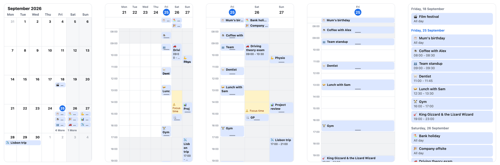
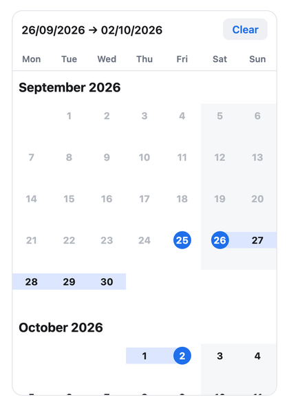
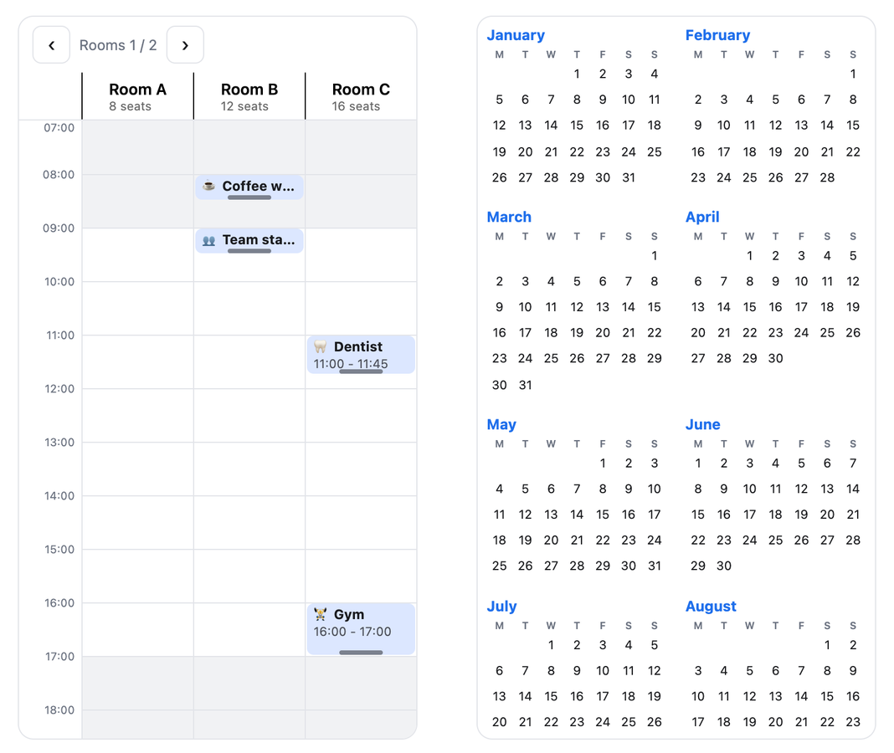

Not every app needs a calendar. But every time I've had to build one in React Native, getting all the behaviours to feel right has been a [pita](https://www.urbandictionary.com/define.php?term=pita). The comfortable libraries render every day in the range up front, so a year view janks the moment you scroll. The lean ones hand you the basics, and you spend your time wiring up the paging and selection they skipped.

So I built [super-calendar](https://super-calendar.afonsojramos.me). It's on npm as [`@super-calendar/native`](https://www.npmjs.com/package/@super-calendar/native) for React Native and [`@super-calendar/dom`](https://www.npmjs.com/package/@super-calendar/dom) for plain react-dom, and there's a [live demo](https://super-calendar.afonsojramos.me/demo) if you'd rather poke at it than read about it.



## Don't render what nobody can see

The thing that pushed me to start was virtualization. Most React Native calendars build every day in the visible range, and often a generous buffer on either side, before you've scrolled anywhere. It's fine for a single month and miserable for anything larger.

super-calendar renders through [`@legendapp/list`](https://legendapp.com/open-source/list/), so it only mounts the dates on screen and snap-pages the rest. You can swipe across years without the list quietly materialising thousands of cells behind you. Paging is one page per swipe by default, with an opt-in `freeSwipe` if you want a fling to carry across several.

The month/week/day model and the name are an homage to [`react-native-big-calendar`](https://github.com/acro5piano/react-native-big-calendar), but I didn't fork it. big-calendar renders every date and doesn't ship a pager at all, so swiping from one week or month to the next is something you wire up yourself; here it's the default. The API differs, and it's built around gestures and virtualization instead of framework-agnosticism. If you're already on big-calendar, the [migration guide](https://super-calendar.afonsojramos.me/migrating-from-big-calendar) has a manual prop mapping plus a copy-paste prompt you can hand to a coding agent, and there's [one for calendar-kit](https://super-calendar.afonsojramos.me/migrating-from-calendar-kit) too.

## Zooming without re-rendering

The part I'm happiest with is the time grid. You can pinch to zoom it on iOS and Android, or Ctrl or Cmd + scroll on the web, and the rows grow and shrink smoothly under your fingers.

The trick is that the row height is a [Reanimated](https://docs.swmansion.com/react-native-reanimated/) shared value rather than React state. The gesture drives that value directly, so the whole zoom runs on the UI thread with zero React re-renders. Events stretch and contract in step with the grid because each one reads the same value. And since `renderEvent` is a real component (it can use hooks) that receives the event box's live pixel height, you can reveal more detail as a slot gets taller: only a title when it's short, a title and time when there's room.

Events themselves are generically typed. `CalendarEvent<T>` carries whatever fields your app already has, so you're not flattening your data into the calendar's shape. You can drag events to move and resize them, and overlapping events lay out in side-by-side columns.

## Date selection, added late

Once the calendar part was solid, it felt incomplete without a way to pick dates.

The picker takes after [flash-calendar](https://github.com/MarceloPrado/flash-calendar): a vertically scrolling list of months where you tap a start and an end, or long-press and drag to sweep a range that flows as a continuous band across month boundaries. A horizontally paged month view can't do that, so selection lives in its own `MonthList`, with a `useDateRange` hook covering single, multiple, and range modes plus disabled days.



Adding it late exposed a packaging problem. The time grid needs Reanimated; the picker doesn't. But if you import `MonthList` from the main entry point, you pull in the whole barrel, and Metro doesn't tree-shake it the way a web bundler would. A team that only wanted a date picker would be paying for Reanimated and the entire timetable they'd never render.

So there's a separate `picker` entry point that exports the month views and selection and nothing from the time grid. Reanimated, its worklets, and gesture-handler are optional peers, and the picker ships its own animation-free default renderer, so a picker-only app skips those native dependencies entirely.

```ts
// Full calendar: time grid, gestures, the works.
import { Calendar } from "@super-calendar/native";

// Picker only: month views and selection, no time grid, no Reanimated.
import { MonthList, useDateRange } from "@super-calendar/native/picker";
```

## 1.0, and 2.0 three days later

I published 1.0 as `react-native-super-calendar` on 26 June. Getting there was mostly packaging work: dual ESM and CommonJS output with per-condition types, an `exports` map that resolves correctly under modern bundlers, a test that fails the build if the docs drift from the real export surface, and publishing through npm's trusted publishing (OIDC, with provenance) so there's no long-lived token sitting around.

The next change came from Jay Meistrich, who makes Legend List. Since version 3, [Legend List](https://legendapp.com/open-source/list/) renders on react-dom as well as React Native, and he suggested on Twitter that super-calendar could do the same. I started splitting it up the day after 1.0.

On 29 June I shipped 2.0 as three packages. [`@super-calendar/core`](https://www.npmjs.com/package/@super-calendar/core) holds everything that doesn't care how it's drawn: date math, event layout, recurrence expansion, time-zone conversion, the selection model, and neutral theme tokens. `@super-calendar/native` is the gesture- and Reanimated-driven renderer from 1.0. `@super-calendar/dom` is new, a react-dom renderer built on Legend List's DOM renderer with no React Native dependency, so a web app no longer has to go through react-native-web to use it. Once it was out, Jay [shared it](https://x.com/jmeistrich/status/2071647526428487932) as a calendar running on both. The unscoped package is gone from npm; everything lives under `@super-calendar` now.

## What other people asked for

Since 1.0, 21 issues have come in, and every single one of them has been addressed. None of them are mine, and a good share of what shipped in 2.2 through 2.11 started as one of them. The longest thread was about a [resource calendar](https://github.com/afonsojramos/super-calendar/issues/26), with rooms or people as lanes, and a [year view](https://github.com/afonsojramos/super-calendar/issues/30) shipped two days after someone asked for it. It feels so good to contribute to open-source and to see people appreciate what you've built. Damn, [jdx](https://github.com/jdx/) must feel really good about mise.



Give it a go: [`@super-calendar/native`](https://www.npmjs.com/package/@super-calendar/native) or [`@super-calendar/dom`](https://www.npmjs.com/package/@super-calendar/dom) on npm, [the source on GitHub](https://github.com/afonsojramos/super-calendar), and the [live demo](https://super-calendar.afonsojramos.me/demo) in your browser.
