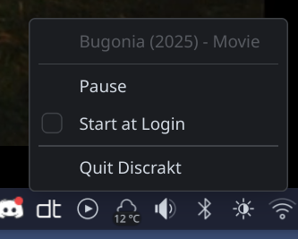

Discord Rich Presence has long been a fun way to broadcast what you are doing - playing a game, listening to Spotify - without saying a word. The same did not exist for what you were watching, especially across the messy reality of streaming today: a movie on the TV, an episode on the iPad in bed, something half-watched on a laptop. Discrakt fills that gap by polling [Trakt](https://trakt.tv) for your "currently watching" status and surfacing it on Discord, regardless of where the content is actually playing.

I built it back when I was gaming a lot more and living in Discord most evenings. I do neither as much these days, but Discrakt has kept ticking along.

The trick is that **anything that scrobbles to Trakt works**. Stremio, Plex, Kodi, Infuse, VLC - any app with a Trakt integration reports playback in real time, and Discrakt picks it up. As long as you have one machine running Discord and Discrakt, your status follows you everywhere else: streaming on the TV from across the room, watching on your phone on the couch, even on a different device entirely.

Built in Rust for low overhead, the app runs quietly from the system tray with separate Rich Presence apps for movies and TV shows, localized titles via TMDB, deep links to IMDB and Trakt, and a browser-based OAuth setup wizard so the first run is "enter your Trakt username and you're done."

Available via [Homebrew](https://github.com/afonsojramos/homebrew-discrakt), Winget, and direct downloads on the [releases page](https://github.com/afonsojramos/discrakt/releases). Source on [GitHub](https://github.com/afonsojramos/discrakt).
