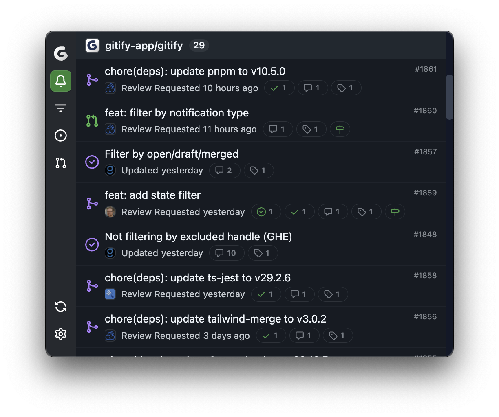
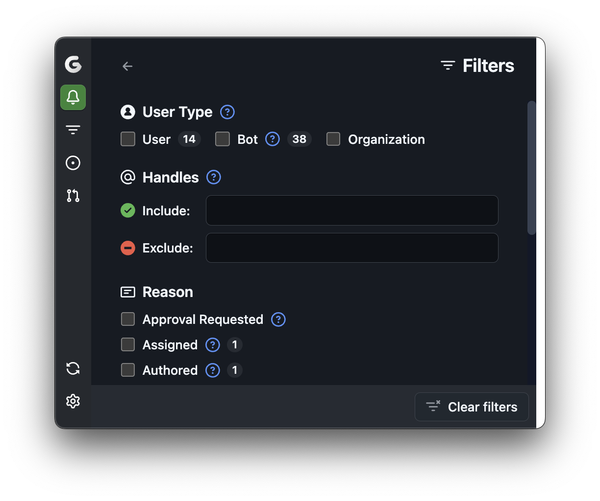
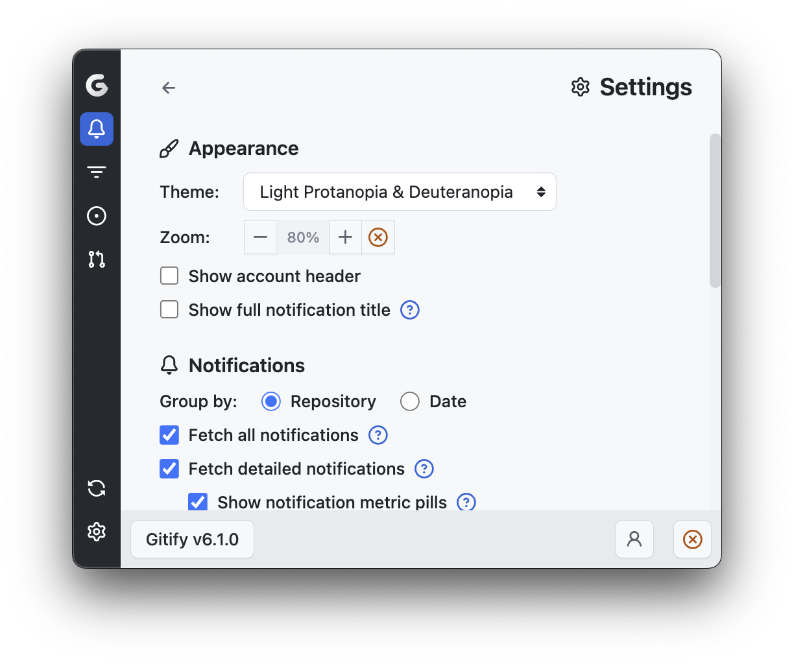

As a core contributor to Gitify since 2022, I've helped revitalize this popular open-source menubar application that streamlines GitHub notification management. Built with Electron, React, and Tailwind CSS, Gitify helps developers stay on top of their GitHub activity without leaving their workflow.

Working alongside a dedicated team of contributors, we've breathed new life into the project through feature development, bug fixes, and architectural improvements. Our efforts have helped grow the project to over 14,000 downloads per release on GitHub alone.

The most rewarding aspect has been seeing how Gitify improves the daily workflow of developers worldwide - myself included. By providing an intuitive interface for managing GitHub notifications, which now also follows GitHub's design system, we're helping developers stay focused and productive.

Experience Gitify for yourself at [gitify.io](https://www.gitify.io) or explore our codebase on [GitHub](https://github.com/gitify-app/gitify).
