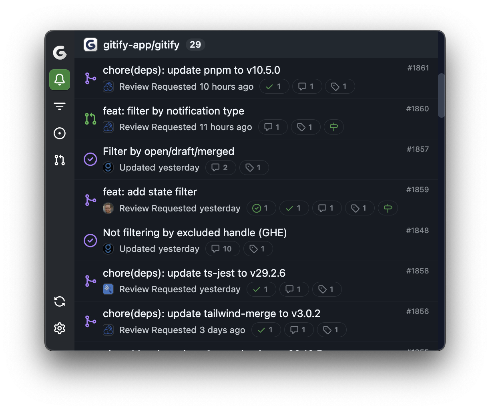
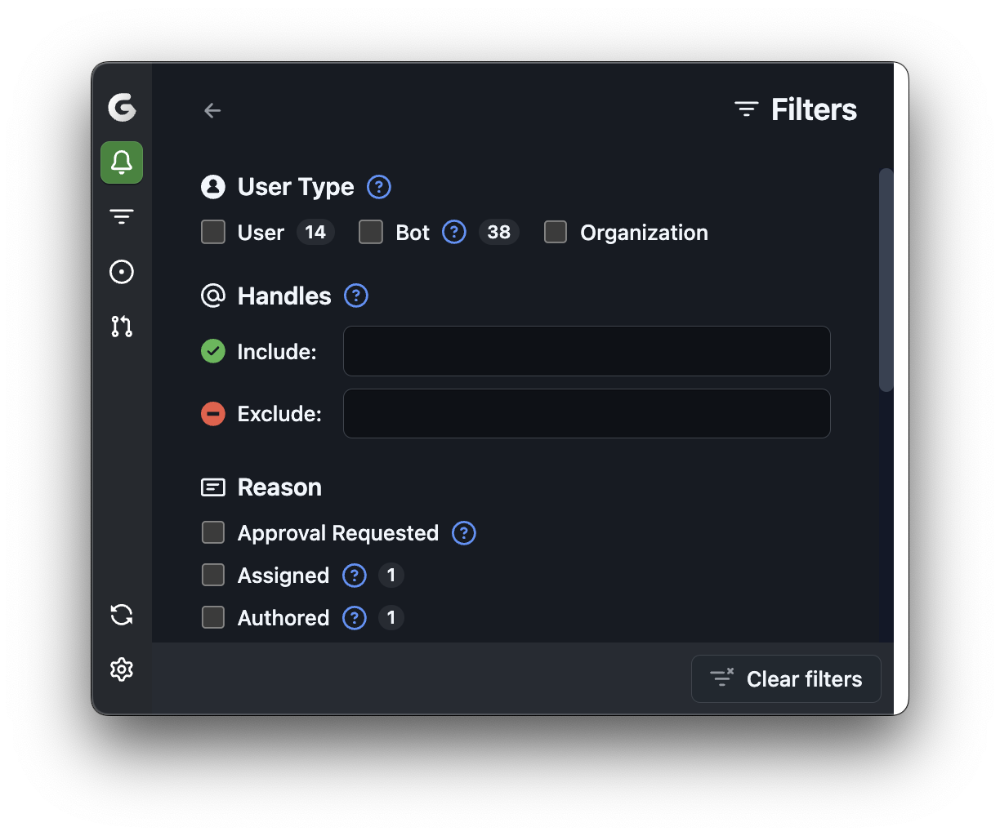
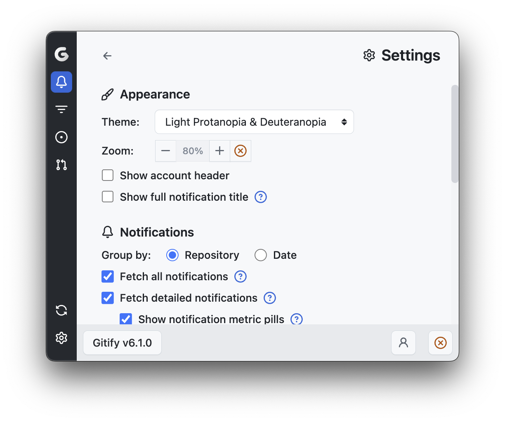

How are GitHub notifications supposed to work anyway? Do you keep the GitHub notifications inbox open in a browser tab, constantly refreshing? Or do you manage to handle the constant flurry of emails for every github notification? For me, the best way to manage something this important, is usually by keeping it in sight, and that's why [Gitify](https://gitify.io) exists. A small menubar app for GitHub notifications. PR reviews, mentions, issue updates, and CI failures show up as an unread count in the menubar; clicking through takes you to the thread. Truly the best way to stay responsive at work and not miss any pings.

I joined the project as a contributor in mid-2023 and stayed on as a core maintainer alongside a small, dedicated team. A lot of the work is the load-bearing kind: improving a long-lived Electron app up to date with latest standards, aligning the UI with [GitHub's Primer design system](https://primer.style) so it feels native to the platform it surfaces, and triaging the steady stream of "this notification didn't show up" reports that come with serving real users. Underneath that, a fairly constant cadence of new features ships with every release with the help of @setchy. Gitify today does meaningfully more than the app I first contributed to.

Over the years Gitify has accumulated **over 1.75 million lifetime downloads** across all releases, 5k+ GitHub stars, and a small but committed maintainer team. TypeScript end-to-end, Electron + React + Tailwind, tested with Vitest.

Feel free to give it a go at [gitify.io](https://www.gitify.io)!
