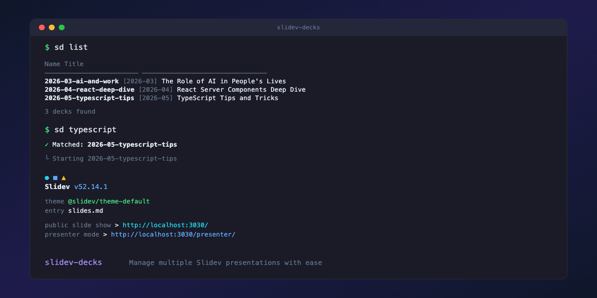

[Slidev](https://sli.dev) is a beautiful slide framework, but it has a single-presentation mental model: one repo, one `slides.md`. If you give a few talks a year and want to keep them all in one place - with shared themes, easy diffing, GitHub Pages deploys - you end up writing the same scaffolding scripts every time. `slidev-decks` is that scaffolding extracted into a small CLI.

It is also, in 2026, one of the best slide tools for the AI era. The source is plain Markdown - an agent can read, edit, or generate a deck end-to-end the same way it edits any other repo, with diffs that review like code and no UI to automate against. Outline a talk in chat, hand it the file, and the slides write themselves. Try doing that with Keynote.

`sd` is the short alias. `sd` alone opens an interactive picker; `sd ai` fuzzy-matches against folder names and frontmatter titles to jump straight to the deck; `sd new` walks you through creating one (templates use `{{TITLE}}` / `{{AUTHOR}}` / `{{YEAR}}` placeholders); `sd build --all` rebuilds everything and skips decks whose source hasn't changed since last build; `sd export ai --dark` produces PDFs. Any flag it doesn't recognise gets forwarded to Slidev untouched, so nothing is taken away.

Detects your package manager from the lockfile. Reads `title`, `date`, `author` from each deck's frontmatter for the picker. Includes a reusable composite GitHub Action for building and deploying every deck under a custom base path. Published on npm as [`slidev-decks`](https://www.npmjs.com/package/slidev-decks); source at [github.com/afonsojramos/slidev-decks](https://github.com/afonsojramos/slidev-decks).
