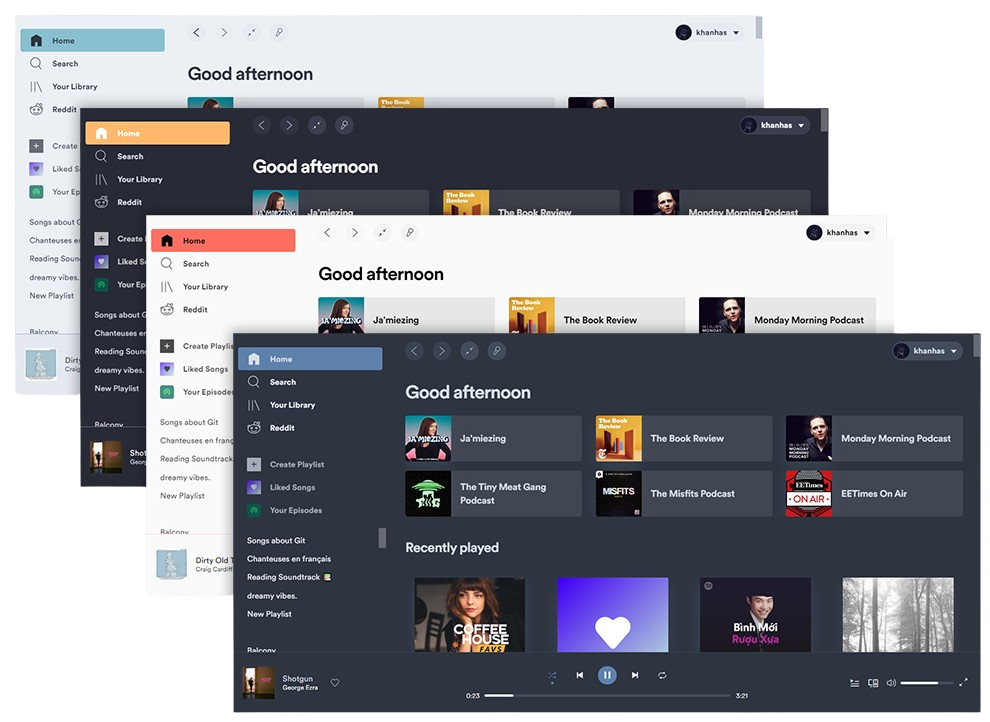

[Spicetify](https://spicetify.app) is a CLI written in Go that patches the official Spotify desktop client to allow theming, custom extensions, and entire custom apps. What started as a small modding project has grown into a full ecosystem: **20M+ lifetime downloads** (~370k per release), 23k+ stars on GitHub, a [marketplace](https://github.com/spicetify/marketplace) for browsing community work, a [creator framework](https://github.com/spicetify/spicetify-creator) for building extensions, and a thriving Discord community.

I have been a core maintainer since 2022, after [@khanhas](https://github.com/khanhas) - the original author - stepped away. The handover happened just as the project was experiencing a surge in popularity, which meant inheriting a backlog of issues and pull requests alongside the very real work of keeping the CLI compatible with each new Spotify release. A lot of that work is regex-driven binary patching, which sounds fragile but is, in fact, fragile.

Beyond the maintenance work, I built and maintain the [Spicetify Documentation](https://spicetify.app) - the canonical reference for installation, theming, and extension development. It pulls in around **300,000 visits a month**! The [opening remarks blog post](/blog/02-spicetify) goes into more depth on the history and how I ended up here. Source for the CLI lives at [github.com/spicetify/cli](https://github.com/spicetify/cli).
